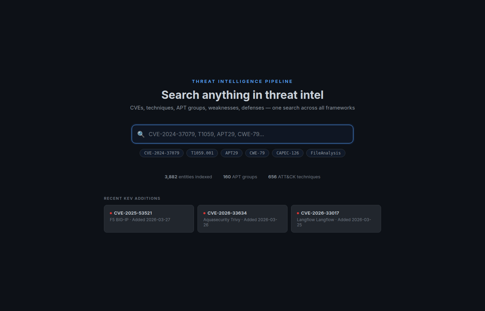
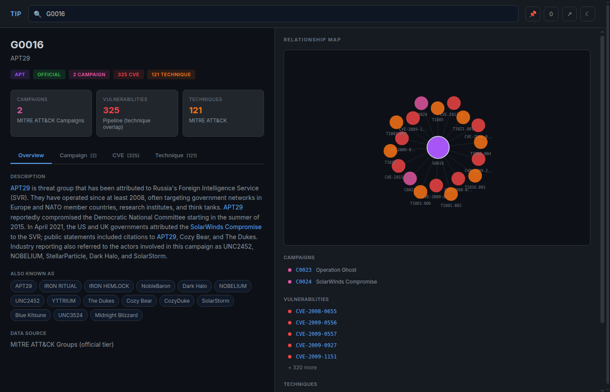
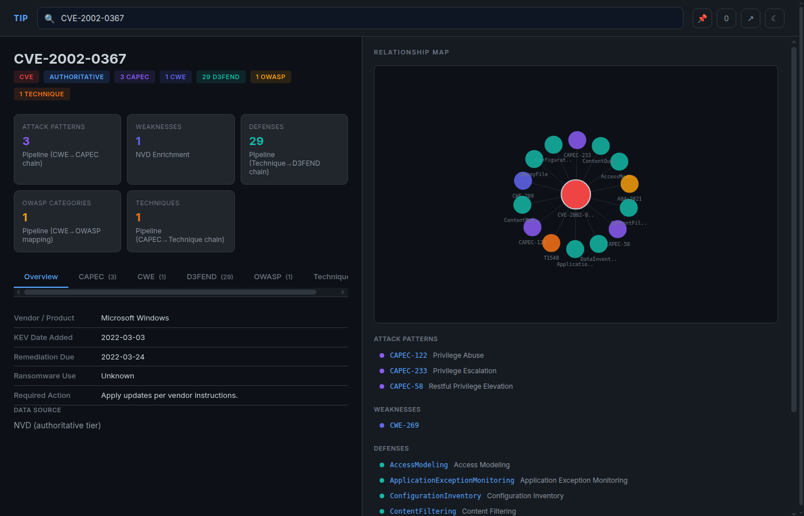

# Threat Intelligence Pipeline (TIP)

> **A note from the author:** I'm not a developer by trade. I'm a hybrid IT and cybersecurity professional who enjoys tinkering, learning, and building useful things along the way. This project is under active development and may break from time to time as I experiment and improve it. Once I'm confident everything is working reliably, I'll remove this notice.

A search-first threat intelligence tool that correlates CVEs across 8 security frameworks. Search any CVE, technique, APT group, or weakness and instantly see its relationships: attack patterns, defensive countermeasures, threat actors, CISA KEV status, and more.

**Live demo:** [nullspace-bitcradle.github.io/Threat_Intelligence_Pipeline](https://nullspace-bitcradle.github.io/Threat_Intelligence_Pipeline/)







## Status snapshot

As of 2026-06-20:

- 357K+ raw CVEs ingested from NVD (357,794 at the last weekly run); every one is searchable by ID via the tiered all-CVE index
- CVSS coverage is corpus-wide: 75,945 historical CVEs backfilled from NVD on 2026-06-11 (the 1999 shard went from 2.4% to 98% scored); extraction falls back v4.0 -> v3.1 -> v3.0 -> v2, so every CVE NVD has ever scored carries a severity
- MITRE sources track always-latest (version pins removed 2026-06-11); ATT&CK reference data is at v19.1 (697 techniques)
- Curated entity graph holds 2,891 enriched CVEs (KEV / APT-linked / vulnrichment) with full cross-framework relationships
- 5,503 total entities across 8 frameworks: 969 CWEs, 697 ATT&CK techniques, 559 CAPECs, 174 APT groups, 147 D3FEND countermeasures, 56 campaigns, 10 OWASP categories
- 1,623 CISA KEV entries tracked with daily refresh
- Fully automated: daily reference database refresh, weekly full CVE pipeline, daily site smoke test, plus a smoke gate on every push
- MCP server Phase A live (3 of 6 planned tools) with JSONL shard fallback, so any ingested CVE is queryable even outside the curated graph; CVE lookups now carry full KEV detail, CISA SSVC decision, CISA CVSS override, CVSS provenance, and D3FEND relationship semantics through a single shared contract used by both the pipeline and the MCP
- Web triage: a worklist mode (paste a list of IDs for one sortable cohort table across CVSS / KEV / ransomware / SSVC / due date), plus KEV / ransomware / SSVC / CISA-override badges and clickable references on CVE pages
- 82 tests passing across pipeline processors, the MCP layer, and a Playwright smoke suite

Counts move on their own: the pipeline auto-commits fresh data daily and weekly. The development plan with status of every item lives in [Plans/MASTER_PLAN.md](Plans/MASTER_PLAN.md). A summary is in the [Roadmap](#roadmap) section below.

## How it works

Search for any entity and TIP shows you its complete threat intelligence picture:

- **CVEs**: weakness mappings, attack patterns, techniques, defensive measures, KEV status, SSVC risk, APT attribution, CVSS score and severity, disclosure dates, references
- **ATT&CK techniques**: associated CVEs, APT groups that use them, D3FEND countermeasures
- **APT groups**: aliases, descriptions, technique usage, linked CVEs and campaigns
- **CWEs**: parent chain, related attack patterns, OWASP categories
- **Campaigns**: attribution, timelines, technique usage

The pipeline builds the correlation chain automatically:

```
CVE -> CWE -> CAPEC -> ATT&CK Techniques -> D3FEND Countermeasures
                                          -> APT Groups (reverse lookup)
    -> OWASP Top 10 Category
    -> CISA KEV Status + Ransomware Use
    -> CISA SSVC Decision + CVSS Override
```

## Web interface

Search-first design with two views.

**Landing page**: one search bar across all entity types, database stats, and quick-access cards for recent KEV additions.

**Result page**: split layout with an intelligence brief on the left (entity header, badges, summary cards, tabbed framework detail) and a D3 force-directed relationship graph on the right showing how the entity connects across frameworks.

Features:
- Search by ID (`CVE-2024-37079`, `T1059`, `CWE-79`) or name (`APT29`, `Log4Shell`)
- CVE pages render full description, CVSS severity badge, KEV / ransomware / SSVC / CISA-CVSS-override triage badges, disclosure dates, and a clickable references list
- Overview tab with descriptions, aliases, KEV details, and data provenance
- Framework tabs: ATT&CK, D3FEND, APT Groups, OWASP, CWE, CAPEC, KEV detail
- Interactive relationship graph; click any node to navigate
- **Worklist / triage mode** (`#/list`): paste a list of IDs and get one sortable table across the cohort — CVSS, KEV, ransomware use, SSVC exploit status, and remediation due date — with a shareable URL
- Investigation pinning with JSON export
- Dark and light theme
- Hash-based routing with shareable URLs and browser back / forward
- Static GitHub Pages deployment, zero install required

## Data sources

| Source | What it provides | Update frequency |
|--------|------------------|------------------|
| NVD API 2.0 | CVE records, CVSS scores, CWE assignments, descriptions, references | Weekly (Actions) |
| MITRE ATT&CK | Attack techniques (enterprise, mobile, ICS) | Weekly (Actions) |
| MITRE ATT&CK Groups | 174 threat groups with aliases and technique usage | Weekly (Actions) |
| MITRE ATT&CK Campaigns | 56 named campaigns with attribution and timelines | Weekly (Actions) |
| MITRE D3FEND | Defensive countermeasure mappings per technique | Weekly (Actions) |
| MITRE CWE | Weakness definitions and parent relationships | Weekly (Actions) |
| MITRE CAPEC | Attack pattern definitions and technique mappings | Weekly (Actions) |
| OWASP Top 10 | CWE to OWASP category mappings | Bundled |
| CISA KEV | Known exploited vulnerabilities, ransomware use, remediation deadlines | Daily (Actions) |
| CISA Vulnrichment | SSVC decisions (exploit status, automatable, impact), CISA CVSS overrides | Daily (Actions) |

## Requirements

- Python 3.9+ (CI runs 3.12 for the pipeline, 3.13 for smoke tests)
- NVD API key (free; recommended for rate limit performance)

## Quick start

### Use the hosted site (no install)

Visit [the GitHub Pages site](https://nullspace-bitcradle.github.io/Threat_Intelligence_Pipeline/). All data is pre-built and updated automatically by GitHub Actions.

### Run locally

```bash
git clone https://github.com/NullSpace-BitCradle/Threat_Intelligence_Pipeline.git
cd Threat_Intelligence_Pipeline
pip install -r requirements.txt
python setup.py

# Set NVD API key (recommended; get one free at https://nvd.nist.gov/developers/request-an-api-key)
export NVD_API_KEY="your-key-here"

# Run the full pipeline
PYTHONPATH=src python run_pipeline.py

# Start local web server
PYTHONPATH=src python run_pipeline.py --web-interface --web-port 8080
```

### CLI options

```bash
PYTHONPATH=src python run_pipeline.py              # Full pipeline
PYTHONPATH=src python run_pipeline.py --db-only    # Update reference databases only
PYTHONPATH=src python run_pipeline.py --cve-only   # Process CVEs only (with resume)
PYTHONPATH=src python run_pipeline.py --force      # Force full update
PYTHONPATH=src python run_pipeline.py --status     # Show pipeline status
PYTHONPATH=src python run_pipeline.py --health-check # System health check
PYTHONPATH=src python run_pipeline.py --metrics    # Show pipeline metrics
```

## GitHub Actions

Three automated workflows keep the data fresh and the site honest:

| Workflow | Trigger | What it does |
|----------|---------|--------------|
| Update Reference Databases | Daily 06:00 UTC | Downloads KEV, Vulnrichment, ATT&CK, D3FEND, CWE, CAPEC, Groups |
| Run CVE Pipeline | Weekly Sunday 08:00 UTC | Fetches new CVEs from NVD, runs full enrichment chain |
| Site Smoke Test | Push / PR + daily 07:00 UTC | Playwright suite: gates pushed content by serving `docs/` locally, plus a daily canary against the deployed site |

The data workflows auto-commit results back to the repo and require `NVD_API_KEY` as a repository secret. The smoke test needs no secrets.

## MCP server (optional)

Expose TIP's threat intelligence graph to Claude agents via the Model Context Protocol (MCP). Claude agents can ground threat reasoning in TIP's real data instead of hallucinating CVE IDs or MITRE relationships.

**Status:** Phase A (v1 MVP) shipped 2026-04-23. Three read-only tools, plus a JSONL shard fallback added 2026-04-24:

- `lookup_entity(entity_id)`: returns a single entity record and its relationships. Falls back to scanning the per-year CVE shard for any CVE not in the enriched entity graph, so any of the 357K+ ingested CVEs is queryable by ID.
- `pivot_from_entity(entity_id, target_type?)`: returns entities related by type. Same shard fallback as `lookup_entity`, so pivoting from any ingested CVE works even if it is not in the enriched graph.
- `search_threat_intel(query, limit?, types?)`: returns ranked hits from the inverted index

CVE lookups carry the full intelligence the pipeline stores in the shards — KEV detail (due date, ransomware use, required action), CISA SSVC decision, CISA CVSS override, CVSS provenance, and D3FEND relationship semantics — projected through `tip_intel.cve_blocks`, the single contract shared with the entity-index generator so both surfaces stay in sync (added 2026-06-20).

Phase B (`build_attack_chain`, `get_defenses`, `kev_status`) is the next development block; see the [Roadmap](#roadmap).

### Install

```bash
pip install -r requirements-mcp.txt
```

Requires TIP's pre-built indexes at `docs/data/entity_index.json` and `docs/data/search_index.json`. Run the pipeline first if they are missing.

### Run

```bash
PYTHONPATH=src python -m tip_mcp.server
```

The server speaks MCP over stdio. It loads both indexes into memory, then waits for a client to connect.

### Claude Code / Claude Desktop configuration

Add an entry to your `.mcp.json`:

```json
{
  "mcpServers": {
    "tip": {
      "command": "python",
      "args": ["-m", "tip_mcp.server"],
      "cwd": "/absolute/path/to/Threat_Intelligence_Pipeline",
      "env": {
        "PYTHONPATH": "src"
      }
    }
  }
}
```

Optionally set `TIP_DATA_DIR` in `env` to override the default `docs/data/` location. Set `TIP_SHARDS_DIR` to override the default `docs/database/` shard location used by the shard fallback.

### Demo prompt

Once the client is configured:

> Use the tip threat intel tools. Look up CVE-2023-44487 and walk me through the attack chain and defenses. Cite entity IDs.

See [src/tip_mcp/README.md](src/tip_mcp/README.md) for full install and tool details.

## Architecture

### Pipeline

```
src/tip/
  core/
    pipeline_orchestrator.py  # Pipeline execution and CLI
    cve_processor.py          # CVE enrichment chain (CWE, CAPEC, technique, D3FEND, OWASP, KEV, SSVC, APT)
    database_manager.py       # Downloads and manages all data sources
    entity_index_generator.py # Builds entity_index.json and search_index.json
    campaign_fetcher.py       # MITRE ATT&CK campaigns ingestion
    owasp_processor.py        # CWE to OWASP mapping
    kev_processor.py          # CISA KEV catalog
    vulnrichment_processor.py # CISA SSVC decisions and CVSS overrides
    apt_processor.py          # ATT&CK Groups with reverse technique index
  monitoring/                 # Health checks, metrics, web server
  utils/                      # Config, error handling, rate limiting
  database/                   # JSONL file manager
src/tip_intel/
  cve_blocks.py               # Shared CVE intelligence contract (KEV/SSVC/CVSS/D3FEND) for generator + MCP
src/tip_mcp/
  loader.py                   # Loads entity / search indexes; CVE shard scanner
  tools.py                    # MCP tool implementations
  server.py                   # FastMCP stdio entry point
  schema.py                   # Response envelope + error codes
```

### Web interface

```
docs/
  index.html                  # Single-page app (landing + results)
  css/
    theme.css                 # Dark and light theme variables
    app.css                   # All layout and component styles
  js/
    app.js                    # Router, search, landing page, theme, investigation
    entity-system.js          # Entity index, search, data lookup helpers
    results.js                # Result page rendering (header, tabs, summary cards)
    worklist.js               # Worklist / triage mode (sortable cohort table)
    graph.js                  # D3 force-directed relationship graph
  data/                       # Reference databases (auto-updated)
  database/                   # CVE database by year (auto-updated)
```

## Testing

```bash
# Unit and integration tests (pipeline + MCP)
PYTHONPATH=src python -m pytest tests/ -v
PYTHONPATH=src python -m pytest tests/ --cov=src/tip

# Browser smoke tests against the live site (requires playwright + pytest-playwright)
pytest tests/smoke/ --browser chromium

# Or against a local copy of the site
python -m http.server 8000 --directory docs &
BASE_URL="http://localhost:8000/" pytest tests/smoke/ --browser chromium
```

Current suite: 82 tests across pipeline processors, the MCP layer, the shared intelligence contract (cross-seam parity), and the Playwright smoke suite. The smoke suite also runs in CI on every push and daily against the deployed site.

## Roadmap

The development plan with rationale, sizing, and acceptance criteria lives in [Plans/MASTER_PLAN.md](Plans/MASTER_PLAN.md). Summary below.

### Shipped

| Item | When | Notes |
|------|------|-------|
| Pipeline foundation (NVD, CWE, CAPEC, ATT&CK, D3FEND, JSONL shards) | pre 2026-03 | `run_pipeline.py` orchestrator with resume support |
| KEV + Vulnrichment + APT integration | 2026-03-14 | Three processors plus unit tests |
| Provenance + Campaigns | 2026-03-18 | Per-entity and per-relationship provenance tiers; 34 MITRE campaigns |
| Search-first UI redesign | 2026-03-28 | Single-search SPA, D3 relationship graph, investigation pinning, hash routing |
| GitHub Actions automation | 2026-03-29 | Daily reference DB updates + weekly CVE pipeline; both auto-commit |
| MCP Phase A | 2026-04-23 | `lookup_entity`, `pivot_from_entity`, `search_threat_intel` over stdio |
| CVE enrichment surgery | 2026-04-24 | Full descriptions, CVSS, dates, references in shards; MCP shard fallback |
| All-CVE tiered search | 2026-04-24 | Every ingested CVE searchable by ID and openable as a detail page |
| P9 stabilization | 2026-06-09 | Pipeline verified healthy, Playwright smoke suite + CI gating, master plan landed |
| CVSS long-tail backfill | 2026-06-11 | 75,945 historical CVEs gained CVSS via one-time NVD pass; processor fallback chain extended v4.0 through v2 |
| Always-latest MITRE sources | 2026-06-11 | ATT&CK STIX de-pinned (was frozen at v16.1); techniques refreshed to v19.1; dead XLSX config removed; CodeQL alerts at zero |
| Enrichment direction decided | 2026-06-11 | CVE2CAPEC adoption rejected (P11 closed); enrichment stays in-house; CWE-gap closure tracked as I21 |
| P9.5 surface-gap closure | 2026-06-20 | MCP now passes full KEV/SSVC/CVSS/D3FEND detail (I22); schema-driven shared contract `tip_intel.cve_blocks` with cross-seam parity test (I24); web triage badges + clickable references (I23); worklist/triage mode (I28); graph node-label and `/health` 404 fixes (I25/I26) |

### Next

| Phase | Item | Notes |
|-------|------|-------|
| P10 | MCP Phase B: `build_attack_chain`, `get_defenses`, `kev_status` | Completes the six-tool MCP surface, plus an end-to-end demo capture |

### Later

| Phase | Item | Notes |
|-------|------|-------|
| P13 | Visual polish, extended exports, worklist follow-ups | Multi-entity worklist MVP shipped 2026-06-20; remaining: graph legend/zoom, worklist filters + CSV export, ATT&CK Navigator export |
| P14 | Pipeline observability and hardening | Run summaries, failure alerting, data-quality checks |
| P15 | Improvements grab-bag | Promoted item by item from the master plan; I21 (CWE-assignment gap closure) slotted #2 |

P11 (CVE2CAPEC parity check) closed 2026-06-11 by decision: enrichment stays in-house. P12 (ctibutler) deferred indefinitely per its conditional.

## License

MIT License. See [LICENSE](LICENSE) for details.

The MIT license covers the code in this repository. The threat intelligence data that the pipeline downloads and redistributes remains the property of its upstream sources and is provided under their respective terms, linked below.

### Data licensing and attribution

This product uses the NVD API but is not endorsed or certified by the NVD.

ATT&CK, D3FEND, CWE, and CAPEC content: © The MITRE Corporation. This work is reproduced and distributed with the permission of The MITRE Corporation.

| Source | Terms |
|--------|-------|
| NVD | [NVD API Terms of Use](https://nvd.nist.gov/developers/terms-of-use) |
| MITRE ATT&CK | [ATT&CK Terms of Use](https://attack.mitre.org/resources/legal-and-branding/terms-of-use/) |
| MITRE D3FEND | [D3FEND Resources / Terms of Use](https://d3fend.mitre.org/resources/) |
| MITRE CWE | [CWE Terms of Use](https://cwe.mitre.org/about/termsofuse.html) |
| MITRE CAPEC | [CAPEC Terms of Use](https://capec.mitre.org/about/termsofuse.html) |
| CISA KEV | [CC0 1.0](https://www.cisa.gov/sites/default/files/licenses/kev/license.txt) |
| CISA Vulnrichment | [CC0 1.0](https://github.com/cisagov/vulnrichment) |
| OWASP Top 10 | [CC BY-SA 4.0](https://owasp.org/www-project-top-ten/) |

Use of this data does not imply endorsement by NIST, MITRE, CISA, DHS, or OWASP.

## Acknowledgments

- [Galeax](https://github.com/Galeax) for the original design that inspired this project
- [NVD](https://nvd.nist.gov/) for CVE data
- [MITRE](https://www.mitre.org/) for ATT&CK, D3FEND, CWE, and CAPEC frameworks
- [CISA](https://www.cisa.gov/) for KEV catalog and Vulnrichment data
- [OWASP](https://owasp.org/) for Top 10 security risk categories
