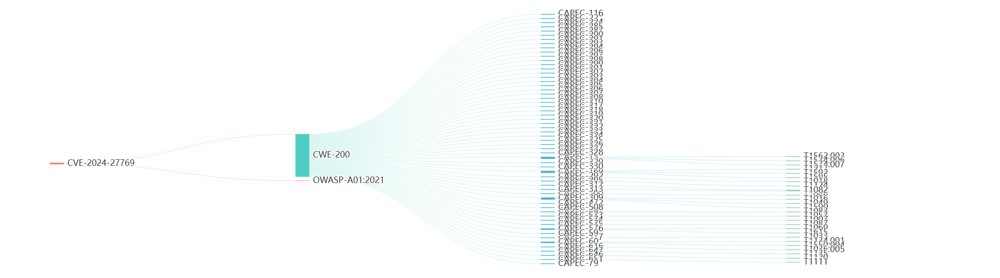
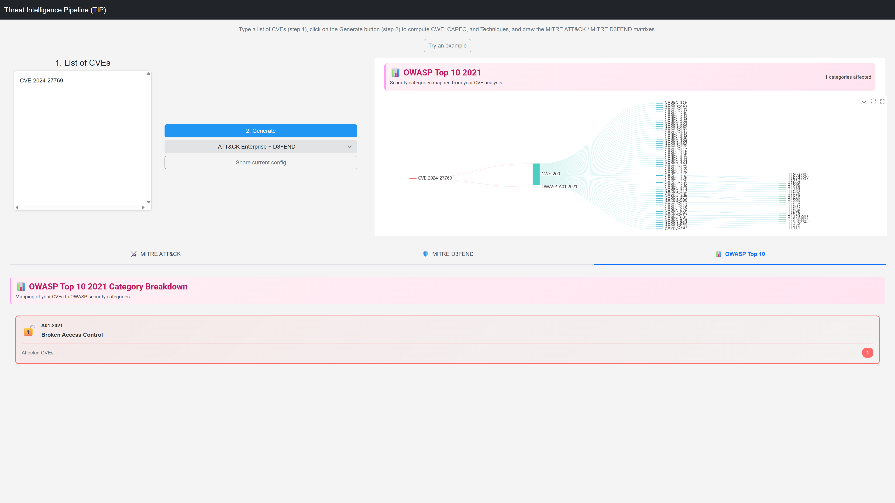
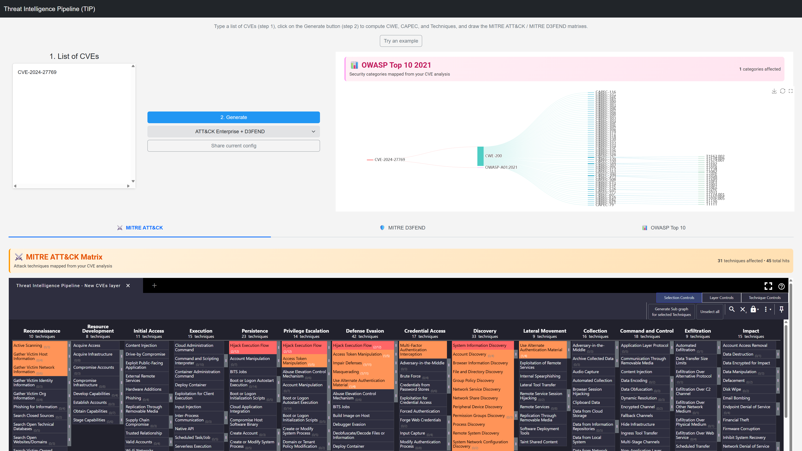
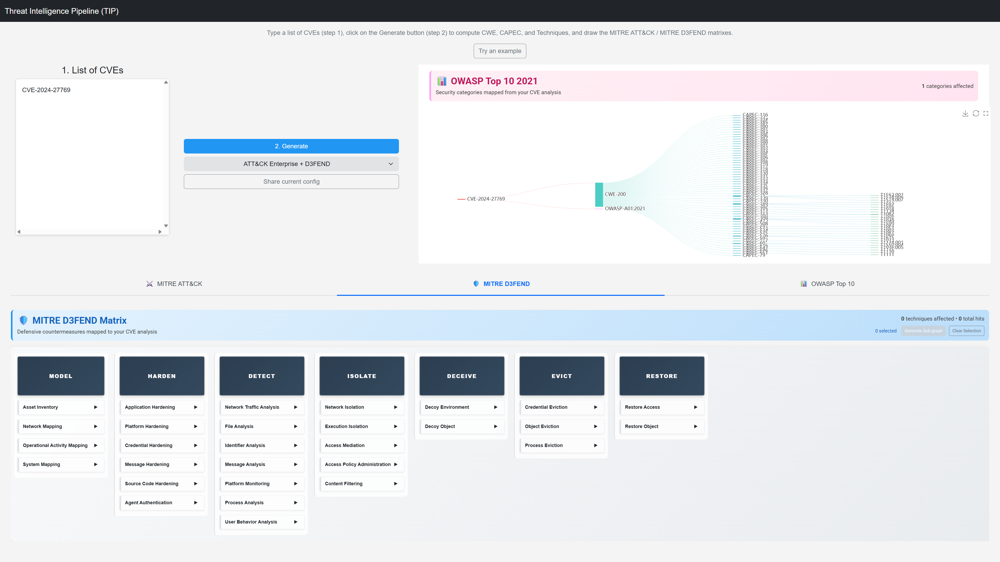

# Threat Intelligence Pipeline (TIP)

> **⚠️ Work in Progress**  
> This project is actively under development with many exciting features and integrations planned for the future. While the core functionality is stable and production-ready, expect regular updates and enhancements as time permits.

## 🎯 Overview

The Threat Intelligence Pipeline (TIP) is an enterprise-grade vulnerability analysis system that automatically retrieves, processes, and correlates Common Vulnerabilities and Exposures (CVEs) with their corresponding Common Weakness Enumeration (CWE), Common Attack Pattern Enumeration and Classification (CAPEC), OWASP Top 10 2021 categories, and MITRE ATT&CK & D3FEND techniques.


*Interactive Sankey diagram showing the complete data flow: CVE → CWE → CAPEC → OWASP → ATT&CK Techniques → D3FEND*

## 🚀 Key Features

- **Complete Historical Data**: Fetches ALL CVEs from 1999 to present (308,619+ CVEs) in a single run
- **OWASP Top 10 2021 Mapping**: Automatic correlation of CVEs to OWASP security categories via CWE mappings
- **Adaptive Rate Limiting**: Intelligent rate limiting that adjusts to API responses and handles 429 errors gracefully
- **Progress Tracking & Resume**: Saves progress every 5,000 CVEs and can resume from interruptions
- **Enterprise Performance**: Connection pooling, advanced caching, parallel processing
- **Robust Error Handling**: Custom exceptions, retry strategies, automatic recovery
- **Comprehensive Monitoring**: Real-time metrics, health checks, detailed reporting
- **Smart API Management**: Exponential backoff, jitter, and dynamic delay adjustment
- **Request Tracking**: Context-aware logging with request ID correlation
- **Health Monitoring**: System health checks with database, API, and resource monitoring
- **Prometheus Metrics**: Full metrics collection with counters, gauges, histograms, and summaries
- **Interactive Web Interface**: Full-featured web UI with CVE analysis, OWASP Top 10 visualization, MITRE ATT&CK matrix, and real-time monitoring
- **Configuration Validation**: JSON schema validation with detailed error reporting
- **Flexible Configuration**: JSON-based config, environment variables, multiple execution modes
- **Single Command Operation**: Run entire pipeline with one command

---

## 📦 Installation

**Prerequisites:** Python 3.8+ and NVD API key (recommended)

```bash
git clone https://github.com/NullSpace-BitCradle/Threat_Intelligence_Pipeline.git
cd Threat_Intelligence_Pipeline
pip install -r requirements.txt
python setup.py
```

---

## 🎯 Quick Start

```bash
# Run complete pipeline (fetches all CVEs from 1999)
python tip.py

# Check system status
python tip.py --status

# Health monitoring
python tip.py --health-check
python tip.py --metrics

# Start web interface
python tip.py --web-interface

# Advanced options
python tip.py --force                 # Force update even if not needed
python tip.py --cve-only             # Process CVEs only (with resume capability)
python tip.py --cve-only --clear-progress  # Start CVE retrieval from beginning
python tip.py --db-only              # Update databases only
python tip.py --verbose              # Enable verbose logging
```

---

## 📊 CVE Data Coverage

**Complete Historical Coverage:**

- **Total CVEs**: 308,619+ vulnerabilities from 1999 to present
- **Year Range**: 1999-2025 (complete NVD database)
- **Single Run**: Retrieves all CVEs in one execution (~15 minutes)
- **Resume Capability**: Can resume from interruptions using progress tracking
- **Adaptive Performance**: Automatically adjusts to API rate limits

**Data Distribution by Year:**

- **1999-2005**: Early vulnerability data (1,000-5,000 CVEs/year)
- **2006-2010**: Growing security awareness (5,000-7,000 CVEs/year)  
- **2011-2015**: Rapid expansion (8,000-10,000 CVEs/year)
- **2016-2020**: Peak vulnerability reporting (17,000-20,000 CVEs/year)
- **2021-2025**: Current era (23,000-38,000 CVEs/year)

**Performance Features:**

- **Smart Rate Limiting**: Starts at 0.5s delay, adapts up to 30s based on API responses
- **Progress Tracking**: Saves progress every 5,000 CVEs for resume capability
- **Error Recovery**: 5 retry attempts with exponential backoff and jitter
- **Memory Efficient**: Processes CVEs in batches to handle large datasets

---

## 🔧 Scheduling

**Linux/Mac (Cron):**

```bash
# Daily updates at 2 AM
0 2 * * * cd /path/to/Threat_Intelligence_Pipeline && python tip.py
```

**Windows (Task Scheduler):**

- Create a task to run `python tip.py` daily
- Set working directory to Threat_Intelligence_Pipeline folder

---

## 🔑 NVD API Key Setup

**Required for optimal performance** - without it, you'll hit rate limits quickly.

1. Get your API key: [NVD API Key Request](https://nvd.nist.gov/developers/request-an-api-key)
2. Set as environment variable:

```bash
# Linux/Mac
export NVD_API_KEY="your-api-key-here"

# Windows
set NVD_API_KEY=your-api-key-here

# Or create .env file
echo NVD_API_KEY=your-api-key-here > .env
```

---

## 📊 System Status & Monitoring

### Command Line Monitoring

```bash
# System health check
python tip.py --health-check

# Show metrics
python tip.py --metrics

# Pipeline status
python tip.py --status
```

### Web Interface Monitoring

```bash
# Start web interface
python tip.py --web-interface --web-port 8080

# Access monitoring endpoints
curl http://localhost:8080/health      # Health status
curl http://localhost:8080/metrics     # Prometheus metrics
curl http://localhost:8080/status      # Pipeline status
curl http://localhost:8080/requests    # Request tracking
```

### Available Metrics

- **API Metrics**: Request counts, durations, success rates
- **Database Metrics**: Operation counts, performance, error rates
- **CVE Processing**: Processing times, success rates, throughput
- **System Metrics**: Memory usage, CPU, disk space
- **Error Metrics**: Error counts by category and severity
- **Cache Metrics**: Hit/miss ratios, performance

---

## 🏗️ Architecture

**Package Structure:**

- **`tip.core`**: Core processing components
  - **CVE Processor**: Handles CVE → CWE → CAPEC → ATT&CK → D3FEND mapping with OWASP correlation
  - **OWASP Processor**: Maps CWE IDs to OWASP Top 10 2021 security categories
  - **Database Manager**: Downloads and processes CAPEC, CWE, ATT&CK, D3FEND, OWASP data
  - **Pipeline Orchestrator**: Manages pipeline execution and monitoring

- **`tip.monitoring`**: Observability and monitoring
  - **Health Checker**: System health monitoring and alerting
  - **Metrics Collector**: Prometheus-compatible metrics collection
  - **Request Tracker**: Request ID correlation and context-aware logging
  - **Web Interface**: Interactive web UI with CVE analysis, OWASP Top 10, MITRE ATT&CK, and D3FEND visualization

- **`tip.utils`**: Utility components
  - **Config Manager**: Configuration management and validation
  - **Error Handler**: Custom exceptions, structured logging, recovery strategies
  - **Rate Limiter**: API rate limiting with token bucket and sliding window algorithms
  - **Performance Optimizer**: HTTP session management, caching, thread pooling
  - **Validation**: Data validation and integrity checks

- **`tip.database`**: Database utilities
  - **Database Optimizer**: Database performance and optimization

**Data Flow:** Database Updates → CVE Retrieval → CVE Processing → Output Generation

**Monitoring Flow:** Health Checks → Metrics Collection → Request Tracking → Web Interface

---

## 🔧 Configuration

**Main config:** `config.json` - API settings, database URLs, processing parameters, logging

**Configuration Validation:**

- JSON schema validation ensures configuration correctness
- Detailed error reporting for invalid configurations
- Automatic validation on startup

**Environment Variables:**

- `NVD_API_KEY`: Your NVD API key for optimal performance
- `LOG_LEVEL`: Override logging level (DEBUG, INFO, WARNING, ERROR, CRITICAL)

**New Configuration Options:**

```json
{
  "processing": {
    "cache_size": 1000,
    "cache_ttl": 3600,
    "use_async_processing": false,
    "max_connections": 100,
    "connection_pool_size": 20
  },
  "error_handling": {
    "enable_circuit_breaker": true,
    "enable_retry": true,
    "enable_recovery": true,
    "alert_thresholds": {
      "critical": 1,
      "high": 5,
      "medium": 20,
      "low": 50
    }
  }
}
```

---

## 📁 Project Structure

```text
Threat_Intelligence_Pipeline/
├── tip.py                    # 🎯 Main entry point
├── setup.py                  # 🛠️ Setup script for initialization
├── config.json               # 📋 Configuration file
├── requirements.txt          # 📦 Dependencies
├── pyproject.toml            # 📦 Project configuration
├── LICENSE                   # 📄 License
├── lastUpdate.txt            # 🕒 Last update timestamp (generated)
├── cve_progress.json         # 📊 CVE retrieval progress (temporary, auto-cleaned)
├── src/                      # 📁 Source code package
│   └── tip/                  # 🐍 Main package
│       ├── __init__.py       # Package initialization
│       ├── core/             # 🎯 Core functionality
│       │   ├── __init__.py
│       │   ├── pipeline_orchestrator.py  # 🎭 Unified orchestration
│       │   ├── cve_processor.py          # ⚙️ Unified CVE processing
│       │   ├── owasp_processor.py        # 📊 OWASP Top 10 mapping
│       │   └── database_manager.py       # 🗄️ Unified database management
│       ├── monitoring/       # 📊 Monitoring & metrics
│       │   ├── __init__.py
│       │   ├── health_check.py           # 🏥 Health monitoring
│       │   ├── metrics.py                # 📈 Metrics collection
│       │   ├── request_tracker.py        # 📊 Request tracking
│       │   └── web_interface.py          # 🌐 Web API interface
│       ├── utils/            # 🛠️ Utilities
│       │   ├── __init__.py
│       │   ├── config.py                 # ⚙️ Configuration management
│       │   ├── config_validator.py       # ✅ Configuration validation
│       │   ├── error_handler.py          # 🛡️ Error handling
│       │   ├── error_recovery.py         # 🔄 Error recovery
│       │   ├── rate_limiter.py           # 🚦 API rate limiting
│       │   ├── validation.py             # ✅ Data validation
│       │   └── performance_optimizer.py  # ⚡ Performance optimization
│       └── database/         # 🗄️ Database utilities
│           ├── __init__.py
│           └── database_optimizer.py     # 🚀 Database optimization
├── database/                 # 📊 CVE database files
│   ├── CVE-1999.jsonl
│   ├── CVE-2000.jsonl
│   └── ... (all years)
├── resources/                # 🗃️ Database resources
│   ├── capec_db.json
│   ├── cwe_db.json
│   ├── owasp_db.json
│   ├── techniques_db.json
│   ├── techniques_association.json
│   └── defend_db.jsonl
├── results/                  # 📈 Results and summaries
│   ├── new_cves.jsonl
│   └── update_summary.json
├── logs/                     # 📝 Log files
│   ├── tip.log
│   └── tip_errors.json
└── docs/                     # 🌐 Web interface
    ├── index.html
    ├── css/
    ├── js/
    └── mitre/
```

---

## 🌐 Web Interface

### Interactive CVE Analysis & Visualization

The web interface provides a comprehensive dashboard for CVE analysis with interactive visualizations for OWASP Top 10, MITRE ATT&CK, and D3FEND:

```bash
# Start the integrated web interface
python tip.py --web-interface --web-port 8080

# Open your browser to:
# http://localhost:8080
```

**Features:**
- **CVE Input & Analysis**: Enter CVEs and get instant correlation analysis
- **OWASP Top 10 2021 Visualization**: Interactive category breakdown showing security classification
- **Interactive MITRE ATT&CK Matrix**: Visual mapping of CVE → CWE → CAPEC → Attack Techniques
- **Real-time Data Processing**: Live correlation with CWE, CAPEC, OWASP, and MITRE ATT&CK data
- **Sankey Diagram Visualization**: Interactive flow diagrams showing vulnerability relationships including OWASP categories
- **D3FEND Integration**: Defensive technique mapping and visualization

#### 📸 Screenshots

**OWASP Top 10 Category Breakdown**

*Interactive cards showing affected OWASP security categories with CVE counts*

**MITRE ATT&CK Matrix**

*MITRE ATT&CK Navigator showing highlighted attack techniques from CVE analysis*

**MITRE D3FEND Countermeasures**

*Defensive techniques mapped from attack patterns*

### API Endpoints

```bash
# Monitoring endpoints
curl http://localhost:8080/health      # Health status
curl http://localhost:8080/metrics     # Prometheus metrics
curl http://localhost:8080/status      # Pipeline status
curl http://localhost:8080/requests    # Request tracking
curl http://localhost:8080/config      # Configuration info

# Control endpoints
curl -X POST http://localhost:8080/api/run              # Run pipeline
curl -X POST http://localhost:8080/api/update-databases # Update databases
curl -X POST http://localhost:8080/api/process-cves     # Process CVEs
```

---

## 🆕 Recent Enhancements

### Complete Historical Data Access

- **Full CVE Database**: Now retrieves ALL 308,619+ CVEs from 1999 to present in a single run
- **Adaptive Rate Limiting**: Intelligent rate limiting that starts at 0.5s and adapts up to 30s based on API responses
- **Progress Tracking**: Saves progress every 5,000 CVEs for resume capability after interruptions
- **Smart Error Handling**: 5 retry attempts with exponential backoff, jitter, and dynamic delay adjustment
- **Single Run Completion**: No more need to run the script multiple times - gets everything in ~15 minutes

### Professional Package Structure

- **Clean Organization**: All Python modules organized into logical packages (`core`, `monitoring`, `utils`, `database`)
- **Better Maintainability**: Related functionality grouped together for easier development and debugging
- **Scalable Architecture**: Easy to add new modules in appropriate locations
- **Python Best Practices**: Follows standard Python packaging conventions
- **Clean Root Directory**: Only essential files remain in the root directory

### OWASP Top 10 2021 Integration

- **Automatic OWASP Mapping**: Maps CVEs to OWASP Top 10 2021 security categories via CWE associations
- **Official Mappings**: Uses comprehensive MITRE CWE-1344 and OWASP published mappings (200+ CWE-to-OWASP correlations)
- **Enhanced CWE Extraction**: Extracts CWE IDs from proper NVD API weaknesses field with regex fallback
- **Interactive Visualization**: Beautiful category cards showing affected OWASP categories with CVE counts
- **Sankey Diagram Integration**: Pink OWASP nodes in flow diagrams showing security classification
- **Parent CWE Support**: Includes parent CWE relationships for comprehensive OWASP coverage

### Integrated Web Interface

- **Unified Experience**: Single command starts both data processing and web interface
- **Interactive CVE Analysis**: Real-time CVE input and correlation analysis
- **OWASP Top 10 Tab**: Dedicated tab with interactive category breakdown and statistics
- **MITRE ATT&CK Visualization**: Interactive matrix showing CVE → CWE → CAPEC → Attack Techniques
- **Comprehensive Data Serving**: Automatic serving of all required static files and databases
- **Modern UI**: Clean, responsive interface with real-time data processing

### Production-Ready Features

- **API Rate Limiting**: Prevents rate limit violations with token bucket and sliding window algorithms
- **Health Monitoring**: Comprehensive system health checks for database, API, and resource monitoring
- **Request Tracking**: Context-aware logging with request ID correlation for better debugging
- **Prometheus Metrics**: Full metrics collection system with counters, gauges, histograms, and summaries
- **Configuration Validation**: JSON schema validation with detailed error reporting
- **Web Interface**: REST API for monitoring, control, and metrics export

### Monitoring & Observability

- Real-time health status monitoring
- Performance metrics collection and export
- Request correlation and debugging
- Error rate tracking and alerting
- System resource monitoring

### Operational Excellence

- Circuit breaker patterns for fault tolerance
- Adaptive rate limiting with backoff strategies
- Comprehensive error recovery mechanisms
- Production-grade logging and monitoring
- Web-based operational interface
- Resume capability for long-running operations

---

## 🔧 Troubleshooting

### Common Issues

**Q: The pipeline stops with 429 errors - what should I do?**
A: The pipeline now handles this automatically! It uses adaptive rate limiting and will retry with exponential backoff. Just let it run - it will complete all 308,619 CVEs in about 15 minutes.

**Q: Can I resume if the pipeline gets interrupted?**
A: Yes! The pipeline saves progress every 5,000 CVEs. If interrupted, just run `python tip.py --cve-only` again and it will resume from where it left off.

**Q: How do I start fresh if I want to re-download everything?**
A: Use `python tip.py --cve-only --clear-progress` to clear the progress file and start from the beginning.

**Q: The pipeline seems slow - is this normal?**
A: Yes! Retrieving 308,619 CVEs takes time. The adaptive rate limiting starts fast (0.5s delays) but increases delays as needed to respect API limits. This is normal and ensures you get all the data.

**Q: Do I need an NVD API key?**
A: It's highly recommended! Without it, you'll hit rate limits much faster. Get one free at: [NVD API Key Request](https://nvd.nist.gov/developers/request-an-api-key)

### Performance Tips

- **Use an NVD API key** for optimal performance
- **Run during off-peak hours** for better API response times
- **Ensure stable internet connection** for the ~15 minute download
- **Monitor logs** to see progress (every 10,000 CVEs)

---

## 🤝 Contributing

1. Fork the repository
2. Create a feature branch (`git checkout -b feature/amazing-feature`)
3. Commit your changes (`git commit -m 'Add some amazing feature'`)
4. Push to the branch (`git push origin feature/amazing-feature`)
5. Open a Pull Request

---

## 📄 License

This project is licensed under the MIT License - see the [LICENSE](LICENSE) file for details.

---

## 🙏 Acknowledgments

- **Original Author**: [Galeax](https://github.com/Galeax) for the initial design and implementation that lead to this project.
- **NVD (National Vulnerability Database)** for providing CVE data
- **MITRE Corporation** for CAPEC, CWE, ATT&CK and D3FEND frameworks
- **OWASP Foundation** for OWASP Top 10 2021 security risk categories and CWE mappings
- **Open source community** for the excellent tools and libraries

---

**🎉 Threat Intelligence Pipeline - Simplifying vulnerability analysis with enterprise-grade performance and reliability!**
