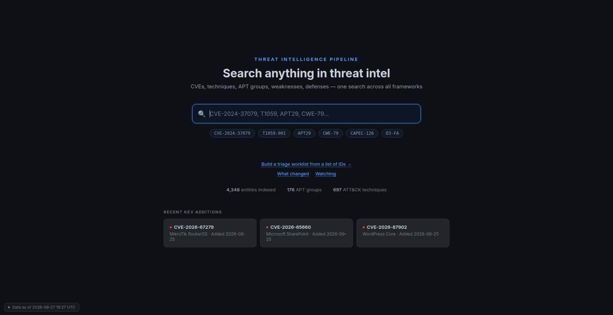
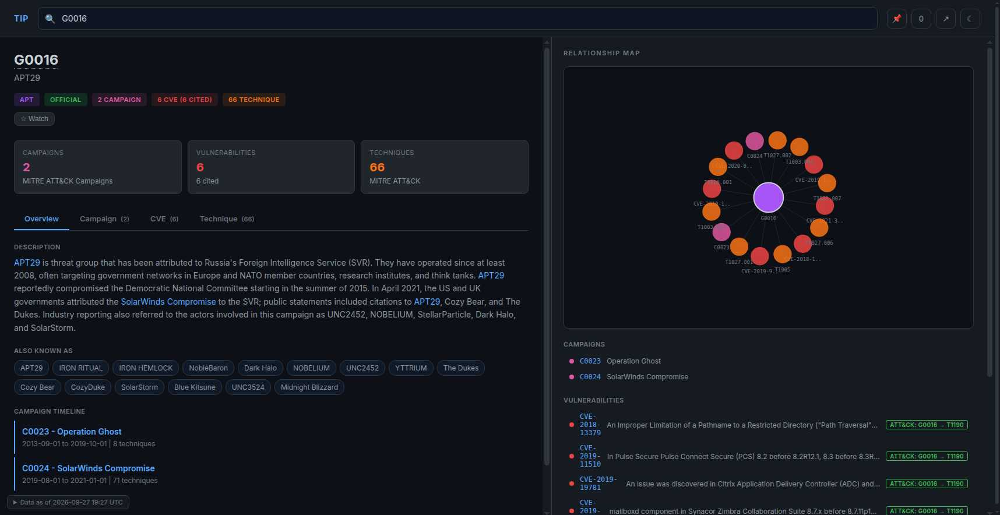
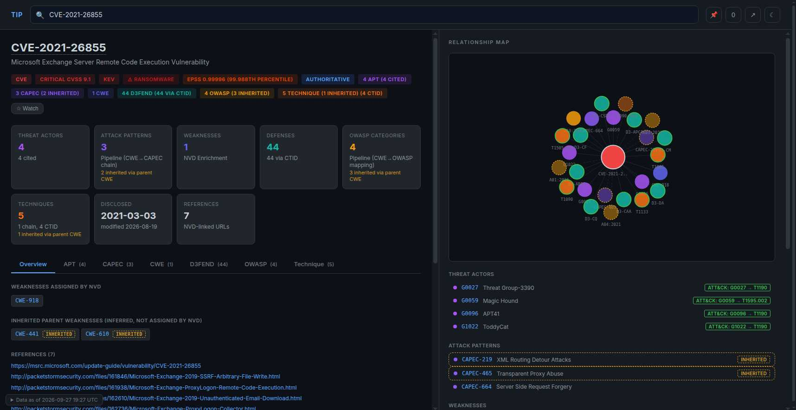

# Threat Intelligence Pipeline (TIP)

> **A note from the author:** I'm not a developer by trade. I'm a hybrid IT and cybersecurity professional who enjoys tinkering, learning, and building useful things along the way. This project is under active development and may break from time to time as I experiment and improve it. Once I'm confident everything is working reliably, I'll remove this notice.

A search-first threat intelligence tool that correlates CVEs across 8 security frameworks. Search any CVE, technique, APT group, or weakness and instantly see its relationships: attack patterns, defensive countermeasures, threat actors, CISA KEV status, and more.

**Live demo:** [nullspace-bitcradle.github.io/Threat_Intelligence_Pipeline](https://nullspace-bitcradle.github.io/Threat_Intelligence_Pipeline/)







## Status snapshot

As of 2026-09-26:

- 395,617 raw CVEs ingested from NVD (published index as of the last pipeline run); every one is searchable by ID via the tiered all-CVE index
- CVSS coverage is corpus-wide: 75,945 historical CVEs backfilled from NVD on 2026-06-11 (the 1999 shard went from 2.4% to 98% scored); extraction falls back v4.0 -> v3.1 -> v3.0 -> v2, so every CVE NVD has ever scored carries a severity
- MITRE sources track always-latest (version pins removed 2026-06-11); ATT&CK reference data is at v19.1 (697 techniques)
- Curated entity graph currently holds 2,971 enriched CVEs under the prior inclusion rule (as published). The corrected rule is KEV, APT-linked, or SSVC exploitation status active; on the next pipeline run the curated set rebuilds to every KEV CVE (1,726 today), and the entity index shrinks to about 4,340 entities (~7.6 MB). Every other ingested CVE stays reachable by ID through the per-year shard fallback on the site and in the MCP, curated or not.
- 5,585 total entities across 8 frameworks (currently published; drops to ~4,340 on the next pipeline run per the curated-CVE rule above): 969 CWEs, 697 ATT&CK techniques, 559 CAPECs, 176 APT groups, 147 D3FEND countermeasures, 56 campaigns, 10 OWASP categories
- 1,726 CISA KEV entries tracked with daily refresh
- Fail-closed by design, and loud about it: a failed, degraded, or partial pipeline step exits non-zero so nothing publishes, and a failed data run or data past its expected age opens a GitHub issue that closes itself on recovery; reference-database writes are atomic and refuse to shrink an existing file below half its record count; shards write atomically with deterministic gzip
- Fully automated: daily reference database refresh, weekly full CVE pipeline, a unit-test + mypy gate on every push to `main` and every pull request, a smoke gate on every push touching the site, plus a daily smoke canary against the deployed site
- MCP server Phase B live (all 6 planned tools, including attack chain, defenses, and KEV status, plus `recent_changes` for the change log) with JSONL shard fallback, so any ingested CVE is queryable even outside the curated graph; CVE lookups now carry full KEV detail, CISA SSVC decision, CISA CVSS override, CVSS provenance, and D3FEND relationship semantics through a single shared contract used by both the pipeline and the MCP
- Web triage: a worklist mode (paste a list of IDs, capped at 25, for one sortable cohort table across CVSS / EPSS / KEV / ransomware / SSVC / due date), plus KEV / ransomware / SSVC / EPSS / CISA-override badges and clickable references on CVE pages
- Technique links name their source (I21): MITRE CTID's analyst mappings for KEV CVEs (official), the CWE chain (derived), an inherited parent CWE (derived, flagged), or one exploitation technique inferred from the CVSS vector (inferred) when nothing else gives any. This reaches the published site with the next weekly run, which rewrites the shards and the index; until then the site shows chain links only. Measured on CVE-2024 re-derived with the I29 approximation (probe in the I21 record, MASTER_PLAN I21): technique coverage 71.8% to 90.5% of records, of which 18.6 points are inferred links (7,319 CVEs), 0.2% CTID and the rest the chain as before
- What changed and watchlists (I7, I8): every data run records what it observed changing (KEV adds and removals, SSVC exploitation, EPSS jumps, CVSS, the curated set) in a 30-day log, `docs/data/changes.json.gz`; the site lists it, lets a reader watch CVEs, CWEs, techniques, APT groups, and KEV vendors and products, and shows the changes that touch them. The log starts with the first data run after merge
- 791 unit tests plus 97 Playwright smoke tests passing; mypy is clean across all 33 source files

Counts move on their own: the pipeline auto-commits fresh data daily and weekly. The development plan with status of every item lives in [Plans/MASTER_PLAN.md](Plans/MASTER_PLAN.md). A summary is in the [Roadmap](#roadmap) section below.

## How it works

Search for any entity and TIP shows you its complete threat intelligence picture:

- **CVEs**: weakness mappings (NVD-assigned apart from inferred parents), attack patterns, techniques, defensive measures, KEV status, SSVC risk, APT attribution, CVSS score and severity, disclosure dates, references
- **ATT&CK techniques**: associated CVEs, APT groups that use them, D3FEND countermeasures
- **APT groups**: aliases, descriptions, technique usage, linked CVEs and campaigns
- **CWEs**: parent chain, related attack patterns (ancestor-inherited ones marked), OWASP categories
- **Campaigns**: attribution, timelines, technique usage

The pipeline builds the correlation chain automatically:

```
CVE -> CWE -> CAPEC -> ATT&CK Techniques -> D3FEND Countermeasures
                                          -> APT Groups (reverse lookup)
    -> OWASP Top 10 Category
    -> CISA KEV Status + Ransomware Use
    -> CISA SSVC Decision + CVSS Override
```

**Assigned versus inherited weaknesses (I29).** A shard record's `CWE` list holds only the CWEs NVD assigned. `CWE_INHERITED` holds one level of MITRE ChildOf parents that NVD did not assign, never one of the ten CWE-1000 pillars (`CWE_PILLARS` in `src/tip/core/id_normalize.py`), which fan out into mappings nobody would defend. `CAPEC`, `TECHNIQUES`, and `OWASP` hold what the assigned CWEs reach; `CAPEC_INHERITED`, `TECHNIQUES_INHERITED`, and `OWASP_INHERITED` hold what only the inherited parents reach, and a `DEFEND` entry reached only through an inherited technique carries `"inherited": true`. In the entity index, `cve` and `cwe` rels name assigned CWEs only, a CVE entity carries `cwe_inherited`, and a rel body may carry an additive `inherited` list: the subset of its `ids` reached only through an inherited parent (for `cwe -> capec`, the CAPECs inherited from an ancestor rather than listed by MITRE for that CWE). `meta.inherited_links` marks an index that carries these fields. The site and the MCP mark every such link as inherited. Shards written before I29 have no `_INHERITED` fields and render exactly as before; the weekly run rewrites them.

**Where a technique link comes from (I21).** A CVE's ATT&CK techniques come from four places, strongest first, and every link says which:

| Source | Tier | What it means |
|--------|------|---------------|
| MITRE CTID Mappings Explorer (KEV) | official | A MITRE analyst mapped the technique to this KEV CVE as its exploitation technique, primary impact, or secondary impact, with a comment |
| CWE chain (CWE to CAPEC to technique) | derived | Reached from a CWE NVD assigned |
| Inherited parent CWE | derived, flagged inherited | Reached only through a ChildOf parent NVD did not assign (I29) |
| Inference from the CVSS vector | inferred | The likely exploitation technique, filled in only when none of the above gives the CVE any technique |

The inference rules live in `src/tip/core/technique_inference.py`, one line per technique, and follow CTID's [ATT&CK to CVE methodology](https://github.com/center-for-threat-informed-defense/attack_to_cve/blob/master/methodology.md) ("Exploitation Techniques" and "Tactic-level Techniques"). They read how the vulnerability is reached, never the CWE. Anything else, including every CVSS v2 vector, gets nothing. Each rule was checked against CTID's analysts on the KEV CVEs CTID maps and the CWE chain cannot reach (161 of 419; a rule fires on 155), comparing the rule's technique with the analyst's mapping:

| CVSS condition | Inferred technique | Fired | Analyst's exploitation technique | Any analyst mapping type |
|---|---|---:|---|---|
| `AV:N` and `UI:N` | T1190 Exploit Public-Facing Application | 76 | 40 (53%) | 42 (55%) |
| user interaction required (v3 `UI:R`, v4 `UI:P` or `UI:A`), not physical | T1204 User Execution | 49 | 24 (49%) T1204 or a sub-technique, 1 of them exact | 25 (51%) T1204 or a sub-technique, 1 exact |
| `AV:L`, `UI:N`, high confidentiality and integrity impact | T1068 Exploitation for Privilege Escalation (privilege escalation, usually recorded by CTID analysts as the impact) | 30 | 13 (43%) | 26 (87%) |

The rule text and its agreement travel with every inferred link (its `source` in shards, the index, and the MCP), so an inferred technique reads as a starting point, not a mapping. Shards keep these links apart: `TECHNIQUES_CTID` (each entry with `mapping_type`, the analyst `comment`, and `source`) and `TECHNIQUES_INFERRED` (each with its `rule` and `source`); CTID mappings in `ctid_db.json` win over a shard written before them. In the entity index a rel body may carry an additive `link_prov` map, id to `{source, tier, ...}`, in both directions: CTID links (official, with `mapping_type`, and the comment on the CVE side), inferred links (inferred, with `rule`), and D3FEND defenses reached through them ("CTID technique, then D3FEND", derived, like the chain's defend links; "Inferred technique, then D3FEND", inferred). A rel body's own `source` and `tier` describe its links, so a reader that ignores `link_prov` under-claims: one source present gives that source, CTID and inferred together give a source naming both (joined by ` + `) at tier inferred, and a body that also holds chain links keeps the chain source at the weakest tier present, with the chain label for those links in `default_prov`. A CTID statement outranks an inherited chain path to the same technique. `meta.link_provenance` marks an index that carries these fields. APT group linkage stays on the chain techniques, so the curated CVE set does not move. CTID's file (ATT&CK 16.1) names three techniques that ATT&CK 19.2 revoked (T1562 and T1562.001, revoked by T1685 Disable or Modify Tools; T1070.001, revoked by T1685.005 Clear Windows Event Logs); those 6 CVE links are not linked and are counted in `meta.ctid_unknown_techniques`. The site marks CTID links (the analyst comment on hover) and inferred links (the rule on hover) apart from chain and inherited links, and each relationship card names the sources its links have (for example "3 CTID" or "2 chain, 1 inferred").

## Web interface

Search-first design with two views.

**Landing page**: one search bar across all entity types, database stats, and quick-access cards for recent KEV additions.

**Result page**: split layout with an intelligence brief on the left (entity header, badges, summary cards, tabbed framework detail) and a D3 force-directed relationship graph on the right showing how the entity connects across frameworks.

Features:
- Search by ID (`CVE-2024-37079`, `T1059`, `CWE-79`) or name (`APT29`, `Log4Shell`)
- CVE pages render full description, CVSS severity badge, KEV / ransomware / SSVC / CISA-CVSS-override triage badges, disclosure dates, and a clickable references list
- Overview tab with descriptions, aliases, KEV details, and data provenance
- Framework tabs: ATT&CK, D3FEND, APT Groups, OWASP, CWE, CAPEC, KEV detail
- Interactive relationship graph; click any node to navigate
- **Worklist / triage mode** (`#/list`): paste a list of IDs and get one sortable table across the cohort (CVSS, EPSS, KEV, ransomware use, SSVC exploit status, and remediation due date) with a shareable URL
- **EPSS** on CVE pages and in the worklist: FIRST's exploitation probability with its percentile and score date. The daily curated file wins over the weekly shard value, and the date says which one you are looking at
- **Watchlist** (I7): a Watch button on every CVE, CWE, technique, and APT group page, and on the KEV vendor and product in a CVE's KEV block. The watchlist lives in this browser only (`localStorage` key `tip-watchlist`), is validated on every read, and a corrupt value reads as empty instead of breaking the page
- **What changed** (`#/changes`, I8): every change the data runs observed in the last 30 days, newest first, filterable by type (`#/changes/<type>`); **Watching** (`#/watching`) lists your watched entities and only the changes that touch them, and the landing page says how many landed this week. See [Change log](#change-log-what-changed)
- **Data freshness** on every page: "Data as of <date>" with a per-source breakdown on expand, and an amber banner naming any source older than it should be (see [Data freshness and failure alerting](#data-freshness-and-failure-alerting))
- Investigation pinning with JSON export
- Dark and light theme
- Hash-based routing with shareable URLs and browser back / forward
- Static GitHub Pages deployment, zero install required

## Data sources

| Source | What it provides | Update frequency |
|--------|------------------|------------------|
| NVD API 2.0 | CVE records, CVSS scores, CWE assignments, descriptions, references | Weekly (Actions) |
| MITRE ATT&CK | Attack techniques (enterprise, mobile, ICS) | Weekly (Actions) |
| MITRE ATT&CK Groups | 176 threat groups with aliases and technique usage | Weekly (Actions) |
| MITRE ATT&CK Campaigns | 56 named campaigns with attribution and timelines | Weekly (Actions) |
| MITRE D3FEND | Defensive countermeasure mappings per technique | Weekly (Actions) |
| MITRE CWE | Weakness definitions and parent relationships | Weekly (Actions) |
| MITRE CAPEC | Attack pattern definitions and technique mappings | Weekly (Actions) |
| OWASP Top 10 | CWE to OWASP category mappings | Bundled |
| CISA KEV | Known exploited vulnerabilities, ransomware use, remediation deadlines | Daily (Actions) |
| MITRE CTID Mappings Explorer (KEV) | Analyst-mapped ATT&CK techniques for KEV CVEs (exploitation technique, primary and secondary impact) with comments; the newest enterprise KEV file is picked from the repository tree (`docs/data/ctid_db.json`) | Daily (Actions) |
| CISA Vulnrichment | SSVC decisions (exploit status, automatable, impact), CISA CVSS overrides | Daily (Actions) |
| FIRST EPSS | Probability of exploitation in the next 30 days (score, percentile, score date) for every scored CVE | Daily for curated CVEs (`docs/data/epss_curated.json`), weekly in the CVE shards; the full daily set is never committed |

## Requirements

- Python 3.13 (matches CI and the hash-locked lockfiles)
- NVD API key (free; recommended for rate limit performance)

## Quick start

### Use the hosted site (no install)

Visit [the GitHub Pages site](https://nullspace-bitcradle.github.io/Threat_Intelligence_Pipeline/). All data is pre-built and updated automatically by GitHub Actions.

### Run locally

```bash
git clone https://github.com/NullSpace-BitCradle/Threat_Intelligence_Pipeline.git
cd Threat_Intelligence_Pipeline
pip install -r requirements.txt
python setup.py

# Set NVD API key (recommended; get one free at https://nvd.nist.gov/developers/request-an-api-key)
export NVD_API_KEY="your-key-here"

# Run the full pipeline
PYTHONPATH=src python run_pipeline.py

# Serve the static site locally
python -m http.server 8000 --directory docs
```

### CLI options

```bash
PYTHONPATH=src python run_pipeline.py                   # Full pipeline
PYTHONPATH=src python run_pipeline.py --force           # Force update even if not needed
PYTHONPATH=src python run_pipeline.py --db-only         # Update reference databases only
PYTHONPATH=src python run_pipeline.py --cve-only        # Process CVEs only (with resume)
PYTHONPATH=src python run_pipeline.py --clear-progress  # Clear progress file and start CVE retrieval from the beginning
PYTHONPATH=src python run_pipeline.py --status          # Show pipeline status
PYTHONPATH=src python run_pipeline.py --verbose         # Enable verbose logging
```

There is no web interface or built-in metrics/health-check flag; the monitoring package that backed them was removed as dead code. The site is static and served from `docs/`, as shown above.

## GitHub Actions

Four automated workflows keep the code honest, the data fresh, and the site working:

| Workflow | Trigger | What it does |
|----------|---------|--------------|
| Unit Tests and Types | Push to `main`, every pull request | Installs from the hash-locked requirements and runs the unit suite (`pytest -q --ignore=tests/smoke`) plus `mypy` |
| Update Reference Databases | Daily 06:00 UTC | Downloads KEV, Vulnrichment, ATT&CK, D3FEND, CWE, CAPEC, Groups, the MITRE CTID KEV mappings, and the EPSS bulk file (publishes only the curated-tier `epss_curated.json`) |
| Run CVE Pipeline | Weekly Sunday 08:00 UTC | Fetches new CVEs from NVD, runs full enrichment chain |
| Site Smoke Test | Push / PR touching `docs/` or `tests/smoke/`, plus a daily 07:00 UTC canary | Local job serves `docs/` from the checkout and gates what's actually being pushed; the daily job runs the same 97-test Playwright suite against the deployed site, then checks the deployed `freshness.json` (stale-data canary) |

The two data workflows auto-commit results back to the repo, share one `concurrency` group so they never overlap, and never force-push: a rebase conflict against `main` fails the run instead. Each commits only when something under `docs/data` or `docs/database` actually changed. Only the weekly CVE pipeline needs `NVD_API_KEY` as a repository secret; the daily reference-database update and both test workflows need no secrets. Both data workflows pass the built-in `GITHUB_TOKEN` to the pipeline step so the CTID tree listing is not rate limited per IP; it is sent as a request header only. Every workflow pins its actions to full commit SHAs. CodeQL runs as GitHub's default setup (actions + Python) and Dependabot proposes weekly updates for pip and GitHub Actions; there is no branch protection configured yet, so these are CI gates a maintainer checks before merging, not enforced required checks.

### Data freshness and failure alerting

Runs fail closed, so the remaining risk is silent staleness. Three pieces cover it, all on GitHub Actions and the built-in `GITHUB_TOKEN`, with no extra secrets, services, or third-party actions.

**Freshness record.** Every pipeline run updates `docs/data/freshness.json` with one entry per source: `label`, `last_success` (ISO 8601 UTC), `cadence_hours`, and `stale_after_hours`. Sources: NVD CVE shards and the entity index (weekly, stale after 8 days), plus KEV, Vulnrichment, EPSS, CWE, CAPEC, ATT&CK, D3FEND, and the MITRE CTID KEV mappings (daily, stale after 36 hours). An entry advances only when its own step succeeded and wrote fresh upstream data; a failed, degraded, or partial step leaves it untouched, even when other sources in the same run succeeded. A step that succeeds without fresh data (a processor that skips and keeps the existing file, such as D3FEND when disabled or when the techniques file is missing, or D3FEND written after its ontology fetch failed) also leaves its entry untouched. The write is atomic, and a failure to write it is logged without turning the run red. Because the data workflows publish only on a clean run, the published file never claims a success that did not happen. The file changes on every clean run, so the daily workflow now makes a data commit every day, even when no upstream content changed; that is intended, since a rarely changing source such as CWE would otherwise look stale.

**Site.** `docs/js/freshness.js` reads the file and shows "Data as of <date>" (the most recent successful update) in the bottom corner of every page, with each source's time, age, and cadence on expand. Any source past its threshold raises an amber banner naming it. Times may end in `Z` or an offset such as `+00:00`. An entry whose time cannot be read is listed as unknown and named in the banner, the same rule the canary uses. A missing or malformed file renders the site exactly as before. Sources absent from the file are unknown, not stale.

**Alerts.** `scripts/pipeline_alert.py` (standard library plus the `gh` CLI, called with argument lists) manages GitHub issues:

| Condition | Label | Issue title | Opened by | Closed by |
|-----------|-------|-------------|-----------|-----------|
| A data workflow run fails, or is cancelled (a job timeout cancels) | `pipeline-failure` | `Data workflow failing: <workflow name>` | that workflow's `Alert on failure` step; later failures comment on the same issue | the next successful run of that workflow, with a recovery comment |
| Any source in the deployed `freshness.json` is past its threshold, or the file cannot be read | `pipeline-stale` | `Published data is stale` | the daily 07:00 UTC smoke canary; later days comment | the first canary that finds every source fresh |

The stale canary is what catches runs that never happened at all (a disabled schedule, an Actions outage). It alerts only when the workflow runs from `main`. The repository has no watchers, so every new alert and every repeat comment starts with an @mention of the repository owner (`github.repository_owner`, passed through `env:` and used only when it is a valid GitHub login); recovery comments carry no mention. Labels are created idempotently on first use. In the data workflows the script never fails the job: any alerting error is logged as a workflow warning and it exits 0. The canary is the opposite: when it cannot alert (bad token, missing permission, Issues disabled, API outage) it prints an error and exits 1, so the smoke job goes red; stale data it did alert on exits 0. `issues: write` is granted only on the three jobs that alert (`update`, `pipeline`, `smoke-live`), and every workflow value reaches the script through `env:`, never through an expression inside a `run:` block. One expected false alarm: a merge between 06:00 and 07:00 UTC, before the first run that writes `freshness.json`, makes the canary open a stale issue that the next day's canary closes.

### Change log (what changed)

Each data run compares the state it is about to replace with the state it wrote and appends what changed to `docs/data/changes.json.gz` (gzipped JSON, read in the browser with `DecompressionStream`, like the CVE shards). The data files are replaced in place, so the pipeline snapshots the published state of each source in memory before any step overwrites it; the workflows fast-forward to `main` first, so that is the last published state. Nothing reads git history.

| Event type | Source | When |
|---|---|---|
| `kev_added`, `kev_removed` | CISA KEV (daily) | A CVE enters or leaves the catalog; `after` (or `before`) carries date added, due date, and ransomware use |
| `ssvc_exploitation_changed` | CISA Vulnrichment (daily) | The SSVC exploitation value changes (`poc` to `active`), or a CVE gets its first decision and it is `poc` or `active` (a first `none` is the daily norm and is not an event) |
| `epss_jump` | `epss_curated.json` (daily and weekly) | A curated CVE's EPSS moves by 0.1 or more, or crosses 0.5 either way |
| `cvss_changed` | Entity index (weekly) | A curated CVE's CVSS score changes |
| `curated_added`, `curated_removed` | Entity index (weekly) | A CVE joins or leaves the curated graph |

Every event has `date` (the run date, UTC), `type`, `cve`, `before`, `after`, and `related`: the CVE's CWEs, techniques, and APT groups from the entity index, and its KEV vendor and product, so a watch on any of them matches. A CVE outside the curated graph carries only what KEV knows about it until the weekly run curates it (its `curated_added` event then carries the full set).

Rules the log keeps:
- **Observed facts only.** A source with no previous file, an empty one, or a partial one (under 90% of the new record count, as when a half-built database is rebuilt in full) adds no "added" events, so a first run or a rebuild never floods the log. Changes on records present in both states are still recorded.
- **Successful steps only.** A source adds events only when its step succeeded and wrote fresh data, the same rule `freshness.json` uses; a failed run publishes nothing at all.
- **Bounded.** Events are merged with the existing log, deduped on (date, type, cve) to the day's net change, and pruned to the last 30 days. Measured on a replay of the 2026-09-20 to 2026-09-27 data commits plus a heavy synthetic EPSS week, the file is 99 KB gzipped, and about 105 KB once the steady-state stream of first `poc` and `active` SSVC decisions is added (about 48 a day, estimated from the CVE-2026 records, 6 KB for 30 days). Stacking an EPSS model release that moves every curated CVE on top of all of that reaches 155 KB (8,288 events), so the log also keeps at most 6,500 events, newest first: that case then writes 135 KB. When the cap drops events, the file's `truncated` and `truncated_through` keys say how many and up to which date, and the site and `recent_changes` say so too. The cap is a count, sized on that probe, not a byte limit.
- **Deterministic and atomic.** Sorted keys, fixed gzip header, one atomic replace; an unchanged log is not rewritten. Writing the log is not a pipeline step: a failure is logged in `results/update_summary.json` and never turns a run red.

## MCP server (optional)

Expose TIP's threat intelligence graph to Claude agents via the Model Context Protocol (MCP). Claude agents can ground threat reasoning in TIP's real data instead of hallucinating CVE IDs or MITRE relationships.

**Status:** Phase B (P10) shipped 2026-09-26: six read-only tools, a JSONL shard fallback so any ingested CVE is queryable by ID, and a recorded end-to-end demo in [src/tip_mcp/DEMO.md](src/tip_mcp/DEMO.md).

| Tool | What it returns | Example prompt |
|---|---|---|
| `lookup_entity(entity_id)` | One entity record and its relationships; any of the 395,617 ingested CVEs via the shard fallback | "What is CVE-2023-44487?" |
| `pivot_from_entity(entity_id, target_type?)` | Related entities, optionally filtered by type, with the same shard fallback | "Which ATT&CK techniques does CVE-2023-44487 map to?" |
| `search_threat_intel(query, limit?, types?)` | Ranked hits from the inverted index | "Find TIP entities about HTTP/2 denial of service." |
| `build_attack_chain(technique_id, limit?)` | The CVEs linked to a technique (KEV first, then CVSS), each explained by its CWE and CAPEC path, plus its D3FEND defenses; every element carries the tier of its weakest hop and its link's own source and tier (a CTID or inferred CVE is labeled by that link), inherited CWE links are flagged, and an empty chain says why | "What is the attack chain behind T1499, and which KEV CVEs sit on it?" |
| `get_defenses(technique_id? \| cve_id?)` | D3FEND countermeasures for one technique or CVE, with mapping source, tier, the technique each was reached through (with that link's source and tier), and the relationship verb; CVE-side defenses are leads through the CVE's techniques and take the weakest tier on the path | "Which D3FEND countermeasures map to T1499?" |
| `kev_status(cve_id)` | CISA KEV membership, dates, ransomware use, required action, vendor, product, SSVC when known, and EPSS (null when unscored) | "Is CVE-2023-44487 in CISA KEV, and when was it due?" |

CVE lookups carry the full intelligence the pipeline stores in the shards: KEV detail (due date, ransomware use, required action), CISA SSVC decision, CISA CVSS override, CVSS provenance, and D3FEND relationship semantics, projected through `tip_intel.cve_blocks`, the single contract shared with the entity-index generator so both surfaces stay in sync (added 2026-06-20).

### Install

```bash
pip install -r requirements-mcp.txt
```

Requires TIP's pre-built indexes at `docs/data/entity_index.json` and `docs/data/search_index.json` (plus `docs/data/kev_db.json` for `kev_status`). Run the pipeline first if they are missing.

### Run

```bash
PYTHONPATH=src python -m tip_mcp.server
```

The server speaks MCP over stdio. It loads both indexes into memory, then waits for a client to connect.

### Claude Code / Claude Desktop configuration

The repo root carries a project-scoped [`.mcp.json`](.mcp.json) that registers the server as `tip-mcp` with relative paths only. Open the clone in Claude Code from a shell where `python3` has `requirements-mcp.txt` installed (or set `TIP_PYTHON` to that interpreter) and approve the server when asked. For Claude Desktop, copy the entry into its config with an absolute `cwd`.

Optionally set `TIP_DATA_DIR` in `env` to override the default `docs/data/` location. Set `TIP_SHARDS_DIR` to override the default `docs/database/` shard location used by the shard fallback.

### Demo

Once the client is configured:

> Use the tip threat intel tools. Look up CVE-2023-44487, walk me through the attack chain and defenses, and tell me how urgent the patch is. Cite entity IDs.

[src/tip_mcp/DEMO.md](src/tip_mcp/DEMO.md) is that walkthrough recorded as a real MCP client session over stdio on this repo's data (lookup, pivot to T1499, `build_attack_chain`, `get_defenses` for T1499 and for the CVE, `kev_status`). `python scripts/mcp_demo.py` regenerates it; add `--check` to verify the committed copy still matches.

See [src/tip_mcp/README.md](src/tip_mcp/README.md) for full install and tool details.

## Architecture

### Pipeline

```
src/tip/
  core/
    pipeline_orchestrator.py  # Pipeline execution and CLI
    cve_processor.py          # CVE enrichment chain (CWE, CAPEC, technique, D3FEND, OWASP, KEV, SSVC, APT)
    database_manager.py       # Downloads and manages all data sources
    entity_index_generator.py # Builds entity_index.json and search_index.json
    campaign_fetcher.py       # MITRE ATT&CK campaigns ingestion
    owasp_processor.py        # CWE to OWASP mapping
    kev_processor.py          # CISA KEV catalog
    ctid_processor.py         # MITRE CTID KEV technique mappings (fail-closed; newest file from the repo tree)
    technique_inference.py    # CTID and inferred technique links; the CVSS inference rules
    epss_processor.py         # FIRST EPSS bulk file (fail-closed; curated-tier file + shard enrichment)
    vulnrichment_processor.py # CISA SSVC decisions and CVSS overrides
    apt_processor.py          # ATT&CK Groups with reverse technique index
  utils/                      # Config, error handling, validation, atomic writes, performance
  database/                   # JSONL file manager
src/tip_intel/
  cve_blocks.py               # Shared CVE intelligence contract (KEV/SSVC/CVSS/EPSS/D3FEND) for generator + MCP
  link_tiers.py               # Technique-link sources and tier ranking shared by generator + MCP
src/tip_mcp/
  loader.py                   # Loads entity / search indexes; CVE shard scanner
  tools.py                    # MCP tool implementations
  server.py                   # MCPServer (mcp 2.x) stdio entry point
  schema.py                   # Response envelope + error codes
```

### Web interface

```
docs/
  index.html                  # Single-page app (landing + results)
  css/
    theme.css                 # Dark and light theme variables
    app.css                   # All layout and component styles
  js/
    app.js                    # Router, search, landing page, theme, investigation
    entity-system.js          # Entity index, search, data lookup helpers
    results.js                # Result page rendering (header, tabs, summary cards)
    worklist.js               # Worklist / triage mode (sortable cohort table)
    watch.js                  # Watchlist, What changed and Watching views (I7, I8)
    freshness.js              # "Data as of" line and stale-data banner
    graph.js                  # D3 force-directed relationship graph
  vendor/                      # d3 7.9.0, pinned and served same-origin (CSP script-src 'self')
  data/                       # Reference databases, freshness.json, changes.json.gz (auto-updated)
  database/                   # CVE database by year (auto-updated)
```

## Testing

```bash
# Unit tests (pipeline + MCP), same command CI runs
PYTHONPATH=src python -m pytest -q --ignore=tests/smoke

# Type check, same command CI runs
python -m mypy

# Browser smoke tests against the live site (requires playwright + pytest-playwright)
pytest tests/smoke/ --browser chromium

# Or against a local copy of the site
python -m http.server 8000 --directory docs &
BASE_URL="http://localhost:8000/" pytest tests/smoke/ --browser chromium
```

Current suite: 791 unit tests across pipeline processors, the MCP layer, the shared intelligence contract (cross-seam parity), freshness recording, the change log, the alert script, and the workflow guards, plus 97 Playwright smoke tests; mypy is clean across all 33 source files. Unit tests and mypy run in CI on every push to `main` and every pull request; the smoke suite runs on pushes and pull requests touching `docs/` or `tests/smoke/`, plus a daily canary against the deployed site.

## Roadmap

The development plan with rationale, sizing, and acceptance criteria lives in [Plans/MASTER_PLAN.md](Plans/MASTER_PLAN.md). Summary below.

### Shipped

| Item | When | Notes |
|------|------|-------|
| Pipeline foundation (NVD, CWE, CAPEC, ATT&CK, D3FEND, JSONL shards) | pre 2026-03 | `run_pipeline.py` orchestrator with resume support |
| KEV + Vulnrichment + APT integration | 2026-03-14 | Three processors plus unit tests |
| Provenance + Campaigns | 2026-03-18 | Per-entity and per-relationship provenance tiers; 34 MITRE campaigns |
| Search-first UI redesign | 2026-03-28 | Single-search SPA, D3 relationship graph, investigation pinning, hash routing |
| GitHub Actions automation | 2026-03-29 | Daily reference DB updates + weekly CVE pipeline; both auto-commit |
| MCP Phase A | 2026-04-23 | `lookup_entity`, `pivot_from_entity`, `search_threat_intel` over stdio |
| CVE enrichment surgery | 2026-04-24 | Full descriptions, CVSS, dates, references in shards; MCP shard fallback |
| All-CVE tiered search | 2026-04-24 | Every ingested CVE searchable by ID and openable as a detail page |
| P9 stabilization | 2026-06-09 | Pipeline verified healthy, Playwright smoke suite + CI gating, master plan landed |
| CVSS long-tail backfill | 2026-06-11 | 75,945 historical CVEs gained CVSS via one-time NVD pass; processor fallback chain extended v4.0 through v2 |
| Always-latest MITRE sources | 2026-06-11 | ATT&CK STIX de-pinned (was frozen at v16.1); techniques refreshed to v19.1; dead XLSX config removed; CodeQL alerts at zero |
| Enrichment direction decided | 2026-06-11 | CVE2CAPEC adoption rejected (P11 closed); enrichment stays in-house; CWE-gap closure tracked as I21 |
| P9.5 surface-gap closure | 2026-06-20 | MCP now passes full KEV/SSVC/CVSS/D3FEND detail (I22); schema-driven shared contract `tip_intel.cve_blocks` with cross-seam parity test (I24); web triage badges + clickable references (I23); worklist/triage mode (I28); graph node-label and `/health` 404 fixes (I25/I26) |
| I21 technique coverage | 2026-09-27 | MITRE CTID KEV mappings (official) and one technique inferred from the CVSS vector (inferred), each link labeled by source and tier; PR #11 |
| P10 MCP Phase B | 2026-09-26 | `build_attack_chain`, `get_defenses`, `kev_status` complete the six-tool MCP surface; project `.mcp.json`; recorded CVE-2023-44487 demo in `src/tip_mcp/DEMO.md` |

### Next

| Phase | Item | Notes |
|-------|------|-------|
| P13 | Visual polish, extended exports, worklist follow-ups | Multi-entity worklist MVP shipped 2026-06-20; remaining: graph legend/zoom, worklist filters + CSV export, ATT&CK Navigator export |

### Later

| Phase | Item | Notes |
|-------|------|-------|
| P14 | Pipeline observability and hardening | Run summaries, data-quality checks; failure alerting and the freshness banner (I16) shipped in PR #10 |
| P15 | Improvements grab-bag | Promoted item by item from the master plan; I21 shipped in PR #11; I7 (watchlists) and I8 (what changed) are in review |

P11 (CVE2CAPEC parity check) closed 2026-06-11 by decision: enrichment stays in-house. P12 (ctibutler) deferred indefinitely per its conditional.

## License

MIT License. See [LICENSE](LICENSE) for details.

The MIT license covers the code in this repository. The threat intelligence data that the pipeline downloads and redistributes remains the property of its upstream sources and is provided under their respective terms, linked below.

### Data licensing and attribution

This product uses the NVD API but is not endorsed or certified by the NVD.

ATT&CK, D3FEND, CWE, and CAPEC content: © The MITRE Corporation. This work is reproduced and distributed with the permission of The MITRE Corporation.

| Source | Terms |
|--------|-------|
| NVD | [NVD API Terms of Use](https://nvd.nist.gov/developers/terms-of-use) |
| MITRE ATT&CK | [ATT&CK Terms of Use](https://attack.mitre.org/resources/legal-and-branding/terms-of-use/) |
| MITRE D3FEND | [D3FEND Resources / Terms of Use](https://d3fend.mitre.org/resources/) |
| MITRE CWE | [CWE Terms of Use](https://cwe.mitre.org/about/termsofuse.html) |
| MITRE CAPEC | [CAPEC Terms of Use](https://capec.mitre.org/about/termsofuse.html) |
| CISA KEV | [CC0 1.0](https://www.cisa.gov/sites/default/files/licenses/kev/license.txt) |
| MITRE CTID Mappings Explorer | [Apache 2.0](https://github.com/center-for-threat-informed-defense/mappings-explorer/blob/main/LICENSE) |
| CISA Vulnrichment | [CC0 1.0](https://github.com/cisagov/vulnrichment) |
| FIRST EPSS | [FIRST EPSS](https://www.first.org/epss/) |
| OWASP Top 10 | [CC BY-SA 4.0](https://owasp.org/www-project-top-ten/) |

Use of this data does not imply endorsement by NIST, MITRE, CISA, DHS, or OWASP.

## Acknowledgments

- [Galeax](https://github.com/Galeax) for the original design that inspired this project
- [NVD](https://nvd.nist.gov/) for CVE data
- [MITRE](https://www.mitre.org/) for ATT&CK, D3FEND, CWE, and CAPEC frameworks
- [CISA](https://www.cisa.gov/) for KEV catalog and Vulnrichment data
- [FIRST](https://www.first.org/epss/) for the Exploit Prediction Scoring System (EPSS)
- [OWASP](https://owasp.org/) for Top 10 security risk categories
